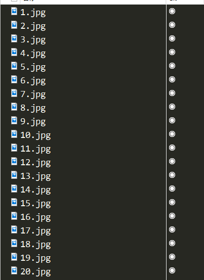
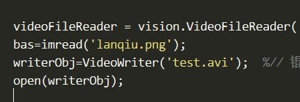

# 基于 MATLAB 的 计算机视觉工具箱的 cxk 篮球换头

> **声明**：素材及其源文件均来自[图灵鸡科技俱乐部](https://space.bilibili.com/381730270)的[【蔡徐坤】我竟然使用了Matlab将cxk的头换成篮球w(ﾟДﾟ)w？！图灵鸡の完整教程~](https://www.bilibili.com/video/av48750111)，并且律师函只给 UP 一个人。不会两开花。

1. 确定训练文件，也就是需要提前进行视频截图，这里使用一个程序 `CAIXUKUNdetector` 对于截取一定的视频帧，保存为图像文件。
   
   这个工作的完成也可以依靠收手动完成，主要是为了标定图像进行分类。

2. 选择好图像之后。需要对图片进行打标签，也就是哪一部分是什么。工具箱为 `Image Labeler`

   在进入工具箱之后，就需要对图片进行标定

   

   这个需要 `New Session`-->`Load`-->`Add image from folder`-->`Define New ROI Label，Scene Label Definition`-->对每一张导入的图片都手工打标-->`Export Labels to file`。

3. 在打标完成导出数据之后，需要对数据进行训练，这里的 `acfDetectortraining.m`文件就是做这个用处的

   ```matlab
   negativefactor=9.5;
   load('cxk\data RGB\copy.mat','gTruth');
   gTruth.LabelDefinitions
   cxklabel = selectLabels(gTruth,'cxk2');
   trainingData = objectDetectorTrainingData(cxklabel);
   summary(trainingData)
   acfDetector3 = trainACFObjectDetector(trainingData,'NegativeSamplesFactor',negativefactor);
   ```

   首先设置的 `negativefactor`值是作为选取框的大小，这个值越大，去噪声越强大，但是有可能会使🏀代替不了头，所以这个数应该适当调节。

4. 训练完成之后，使用 `acfDetectortest.m` 文件进行测试，测试会告诉你每一帧🏀在什么或者在不在。

5. 在觉得 🆗 之后，就使用换头程序，`basreplacement1.m` 使 CascadeObjectDetector 的篮球换脸程序

   `basreplacement2.m` 使 acfDetector 的篮球换脸程序。这个完成之后会输出对应的视频。名字可以在这里改
   

   这个 `test.avi`也就是程序输出的换头视频。到此换头程序也就结束了，但是具体的代码我还没研究过，这里只是比 UP 的视频做的稍微详细一些。等之后理解代码了再来详细分析。

